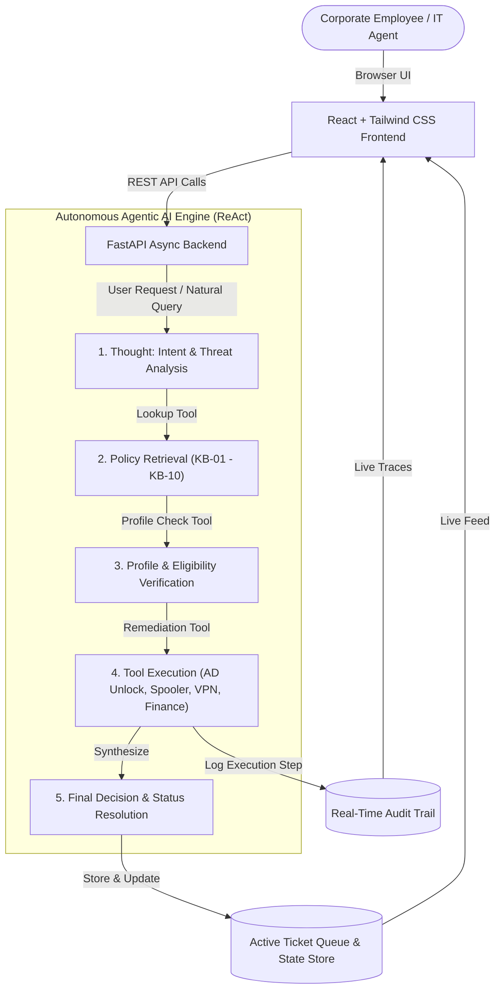

# Veridian Corp Internal IT Service Portal

> **Enterprise IT Service Management (ITSM) Web Application powered by Autonomous Agentic AI**  
> Based on **Assignment 2 (Internal Service Agent)** specifications for Veridian Corp.

---

## 1. System Architecture & Tech Stack

The portal implements an enterprise-grade, decoupled architecture combining an interactive **React + Tailwind CSS** corporate frontend with a high-performance **FastAPI** asynchronous backend orchestrating an **Autonomous Agentic ReAct loop**.



### Technology Highlights
- **Frontend**: React 18, Vite 5, Tailwind CSS, Lucide Icons, Custom Scrollbars, Glassmorphism, Status Indicators.
- **Backend / API**: FastAPI, Uvicorn (ASGI), Pydantic v2 data validation, Starlette.
- **Agentic Engine**: Autonomous ReAct reasoning loop (Thought -> Action -> Observation -> Decision) applying policies KB-01 through KB-10, with support for OpenAI/Gemini function calling when API keys are supplied, and deterministic autonomous execution out-of-the-box.
- **Observability**: Real-time event streaming and logging of agent thoughts, tool calls, and decisions.

---

## 2. IT Policy Matrix (KB-01 to KB-10)

The backend agent strictly enforces the 10 corporate IT policies specified in Assignment 2:

| Policy ID | Policy Title | Scope & Eligibility | SLA | Approval Workflow & Automated Remediation |
| :--- | :--- | :--- | :--- | :--- |
| **KB-01** | Password Reset & Account Lockout | All Employees & Contractors | Immediate (< 5 min) | Self-service guidance; automatically clears Kerberos lockout and resets `BadPwdCount` in Active Directory if locked after 5 failed attempts. |
| **KB-02** | Corporate VPN Access | FTEs vs Contractors | FTE: < 1h / Cont: 24h | **Automatic approval** for Full-Time Employees; **Manager sign-off required** via electronic form for Contractors (`Pending Review`). |
| **KB-03** | Laptop Replacement & Refresh | Device Age >= 3.0 yrs or HW failure | 2-3 Business Days | **Auto-approved** if tenure >= 3 years with 2-week notice; premature requests without verified hardware defect are queued for Tier 2 diagnostics. |
| **KB-04** | Software Installation & Governance | Standard Catalog vs Non-Catalog | Catalog: < 15 min / Non: 3-5 days | Pre-approved catalog apps (Slack, VS Code, Zoom, Figma, Docker) auto-approved for self-install; third-party non-catalog triggers **IT Security Review**. |
| **KB-05** | Office Printer Troubleshooting | All On-Site Personnel | Spooler: < 5 min / Tech: 4h | Automated remote restart of Windows Print Spooler service (`spoolsv.exe`) and queue purge; if failure persists, logs Tier 2 field ticket with asset tag. |
| **KB-06** | Mailbox Quota Increase | Default 25GB Ceiling | 24 Hours | Requests up to 50GB require **Direct Manager approval**; requests >50GB trigger **IT Director sign-off** and online archiving compliance audit. |
| **KB-07** | Guest Wi-Fi Access | Visitors, Clients, Guests | Immediate (< 1 min) | Instant generation of dynamic 24-hour guest voucher key; no permanent IT ticketing overhead required. |
| **KB-08** | Expense Software Access (Concur) | Employees filing expenses | Immediate Redirect | Managed exclusively by **Corporate Finance**, not IT. Agent automatically redirects user to `finance-systems@veridian-corp.example`. |
| **KB-09** | Security Incident & Phishing | Mandatory for all staff | Immediate (< 15 min) | Sets priority to **Critical**; warns user **NEVER to forward** suspicious email to teammates; initiates message quarantine and alerts SecOps SIEM. |
| **KB-10** | Work-From-Home Equipment | Remote Workers | 3-5 Business Days | Remote > 3 days/week eligible for **$750 home office allowance** with manager & Finance sign-off; hybrid <=3 days directed to in-office supply desk. |

---

## 3. Multi-Page Architecture

1. **Dashboard (`/`)**:
   - Real-time IT infrastructure telemetry (Active Directory, GlobalProtect VPN, Exchange Online, Spoolers, Jira, SIEM).
   - KPI metrics: Total Tickets, In Progress, Pending Review, Auto-Resolved, and Escalations.
   - **Quick-Action AI Assistant**: Instant natural language query box with 4 pre-set prompt chips and real-time agent evaluation.
   - Recent ticket activity feed with status badges.

2. **Submit Request (`/submit`)**:
   - Interactive service portal covering all 10 KB categories.
   - Dynamic context-sensitive fields (e.g. Device age slider for laptops, catalog selector for software, remote days counter for WFH, lockout toggle for passwords).
   - Live **Policy Pre-Check** previewing SOP, SLAs, and approval requirements as the user inputs details.
   - Real-time modal displaying the agent's reasoning steps, tool actions taken, and generated ticket.

3. **Active Ticket Queue (`/tickets`)**:
   - Live enterprise table with search by Ticket ID, Requester, Title, or Policy.
   - Status filters (`In Progress`, `Pending Review`, `Resolved`, `Escalated`) and Priority filters.
   - Interactive Ticket Detail Drawer with conversation notes, reasoning logs, and operator action controls (`Approve`, `Escalate to Tier 2`, `Reopen`, `Add Note`).

4. **Knowledge Base (`/policies`)**:
   - Complete searchable repository of policies KB-01 through KB-10.
   - Filter by operational department category.
   - Expandable SOP steps, eligibility requirements, and SLAs.
   - "Test Scenario with Agent" button that pre-populates the request form.

5. **Agentic Audit Trail (`/audit`)**:
   - Enterprise observability console showing real-time agent execution traces.
   - Filter by log level (`THOUGHT`, `POLICY_CHECK`, `PROFILE_CHECK`, `TOOL_EXEC`, `DECISION`, `ESCALATION`).
   - Collapsible **Tool I/O Payload Inspector** showing JSON inputs and outputs for complete transparency.

6. **User Profile & Persona Switcher (`/profile`)**:
   - Requester profile, active corporate device tracking (ThinkPad X1, serial tag, deployment date), and mailbox storage gauge bar.
   - **Live Persona Switcher**: One-click simulation of 4 diverse employee personas:
     - **Sarah Chen** (Full-Time, 3.6y tenure, Remote 4 days) -> Tests KB-02 FTE auto-approval, KB-03 3-year laptop refresh, KB-10 WFH allowance.
     - **Alex Rivera** (Contractor, 0.8y tenure, Hybrid 2 days) -> Tests KB-02 Contractor VPN manager sign-off, KB-03 <3yr laptop, KB-10 hybrid.
     - **David Kim** (Marketing Lead, In-Office) -> Tests KB-05 Printer spooler reset, KB-09 Critical phishing response.
     - **Elena Rostova** (Locked Out Finance Analyst, 5 failed attempts) -> Tests KB-01 Automated Active Directory account unlock.

---

## 4. API Documentation & Endpoints

| Method | Endpoint | Description |
| :--- | :--- | :--- |
| `POST` | `/api/v1/requests` | Submit IT request and trigger autonomous agent reasoning loop. |
| `POST` | `/api/v1/requests/quick-query` | Pre-evaluate natural language query and preview policy match. |
| `GET` | `/api/v1/tickets` | Retrieve all tickets with filters (`status`, `category`, `priority`, `search`). |
| `GET` | `/api/v1/tickets/{id}` | Get ticket details and reasoning steps. |
| `POST` | `/api/v1/tickets/{id}/action` | Perform operational action (`approve`, `escalate`, `resolve`, `add_note`). |
| `GET` | `/api/v1/policies` | Retrieve all 10 IT policies (KB-01 to KB-10) with search. |
| `GET` | `/api/v1/policies/{id}` | Retrieve specific policy by ID. |
| `GET` | `/api/v1/audit-logs` | Retrieve real-time agent reasoning steps and tool execution traces. |
| `POST` | `/api/v1/audit-logs/clear` | Clear in-memory audit logs. |
| `GET` | `/api/v1/profile` | Retrieve currently active employee profile. |
| `PUT` | `/api/v1/profile` | Update profile attributes (e.g. remote days). |
| `GET` | `/api/v1/profile/personas` | Retrieve available switchable test personas. |
| `POST` | `/api/v1/profile/switch/{id}` | Switch active test persona. |
| `GET` | `/api/v1/system/health` | Telemetry status of Active Directory, VPN, Spoolers, and SIEM. |
| `POST` | `/api/v1/system/seed` | Reset portal state to default demonstration dataset. |

---

## 5. Quickstart & Local Execution

### Option A: One-Command Python Runner (Recommended)
```bash
# 1. Activate virtual environment or use system python
python run.py
```
> This checks the frontend build, starts the unified FastAPI server on `http://127.0.0.1:8000`, and opens your default browser automatically.

### Option B: Windows Batch Launcher
Double-click `start.bat` in the project root directory.

### Option C: Docker & Docker Compose
```bash
# Build and run single container
docker-compose up --build
```
> Access the portal at `http://localhost:8000`.

### Option D: Manual Step-by-Step Run
```bash
# Terminal 1: Backend
pip install -r requirements.txt
python -m uvicorn backend.main:app --host 0.0.0.0 --port 8000 --reload

# Terminal 2: Frontend (optional in dev mode)
cd frontend
npm install
npm run dev
```

---

## 6. Cloud Deployment Instructions

### Deploy to Render
1. Connect your repository to [Render](https://render.com).
2. Choose **Web Service** and select **Docker** as the runtime.
3. Set the environment variable `PORT=8000`.
4. Click **Deploy**. Render will execute the multi-stage Dockerfile, build the frontend, and launch FastAPI.

### Deploy to Hugging Face Spaces (Docker Space)
1. Create a new Space with SDK type **Docker**.
2. Push this repository to your Space. The root `Dockerfile` will compile and launch the application on port 8000.

---

## 7. Verification & Automated Testing

Run the automated test suite verifying all 10 policies, persona switching, and audit trails:
```bash
pytest tests/test_api.py -v
```
**Result:**
```
tests/test_api.py::test_health PASSED                                    [  6%]
tests/test_api.py::test_get_policies PASSED                              [ 13%]
tests/test_api.py::test_profile_and_persona_switch PASSED                [ 20%]
tests/test_api.py::test_kb01_password_reset_and_lockout PASSED           [ 26%]
tests/test_api.py::test_kb02_vpn_fte_vs_contractor PASSED                [ 33%]
tests/test_api.py::test_kb03_laptop_replacement_tenure PASSED            [ 40%]
tests/test_api.py::test_kb04_software_installation_catalog_vs_noncatalog PASSED [ 46%]
tests/test_api.py::test_kb05_printer_troubleshooting PASSED              [ 53%]
tests/test_api.py::test_kb06_mailbox_quota PASSED                        [ 60%]
tests/test_api.py::test_kb07_guest_wifi PASSED                           [ 66%]
tests/test_api.py::test_kb08_expense_software_routing PASSED             [ 73%]
tests/test_api.py::test_kb09_security_incident_phishing PASSED           [ 80%]
tests/test_api.py::test_kb10_wfh_equipment_allowance PASSED              [ 86%]
tests/test_api.py::test_ticket_actions PASSED                            [ 93%]
tests/test_api.py::test_audit_logs_realtime PASSED                       [100%]
======================= 15 passed in 1.03s =======================
```
